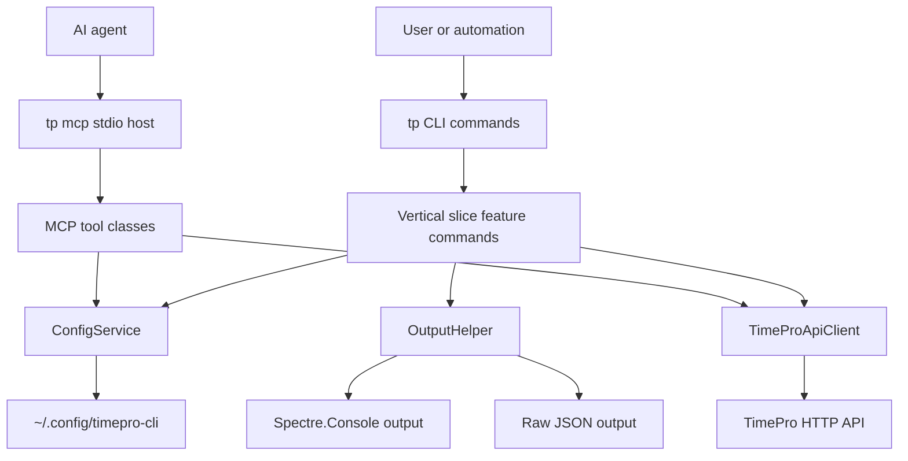

# Technologies and Architecture

This document is the current technical overview for the TimePro CLI and MCP host. It covers the technology stack, main design patterns, data flow, and project workflow.

## Architecture Overview



The application is a local command-line tool. It does not host a web app or database. It reads local configuration, calls the existing TimePro HTTP API, and prints either human-friendly terminal output or machine-readable JSON.

## Technology Stack

| Area | Technology | Notes |
|------|------------|-------|
| Runtime | .NET 10 (`net10.0`) | Packaged as a global `dotnet` tool named `tp`. |
| CLI framework | Spectre.Console.Cli | Command parsing, settings, help text, and command dispatch. |
| Terminal UI | Spectre.Console | Tables, markup, prompts, and confirmation flows. |
| Dependency injection | Microsoft.Extensions.DependencyInjection | Shared service registration for commands and infrastructure. |
| HTTP | Microsoft.Extensions.Http + `HttpClient` | Used by the shared TimePro API client. |
| JSON | System.Text.Json | CLI JSON output, config files, and API DTO serialization. |
| MCP | ModelContextProtocol | Exposes selected TimePro operations over stdio for local agents. |
| Unit tests | xUnit, FluentAssertions, NSubstitute | Fast logic tests. |
| Integration tests | xUnit, WireMock.Net | Command/API integration without live TimePro calls. |
| Packaging | `dotnet pack` / global tool install | Outputs a local NuGet package for installation. |

## Project Shape

The repo uses Vertical Slice Architecture for user-facing features:

```text
src/SSW.TimePro.Cli/
├── Program.cs
├── Features/
│   ├── Auth/
│   ├── Tenants/
│   ├── Timesheets/
│   ├── Leave/
│   ├── Scrum/
│   ├── Mcp/
│   └── ...
├── Infrastructure/
│   ├── ApiClient/
│   ├── Config/
│   ├── DependencyInjection/
│   └── Output/
└── Shared/Models/
```

Each CLI command lives with its feature area and owns its settings, validation, API calls, and rendering path. Shared cross-cutting code stays in `Infrastructure/`.

## Design Patterns

- Vertical Slice Architecture: commands are grouped by feature rather than by technical layer.
- Single shared API client: `TimeProApiClient` owns HTTP calls, authentication headers, and endpoint-specific request/response code.
- DTO-first boundaries: API shapes live under `Shared/Models/` and are kept separate from command settings.
- Dual output paths: commands use `OutputHelper` so `--json` writes raw JSON and human output stays Spectre-rendered.
- Local configuration service: `ConfigService` reads and writes global config, tenant config, and repo mappings.
- MCP tool facade: MCP tools call the same infrastructure as CLI commands instead of duplicating API plumbing.

## Configuration and Secrets

Runtime configuration is stored under `~/.config/timepro-cli/`:

```text
~/.config/timepro-cli/
├── config.json
├── tenants/
│   └── {id}.json
└── repo-mappings.json
```

Tenant config contains the TimePro API key. Commands that display tenant details must not serialize or print the API key. Use `TenantConfig.ToSummary()` or another explicit safe view for user-facing JSON.

Project secrets for development should come from environment variables loaded by `direnv`; do not commit plaintext secret files.

## Main Runtime Flows

### CLI command

1. Spectre.Console.Cli parses the command and settings.
2. The command loads config through `IConfigService`.
3. The command validates required tenant and employee context.
4. The command calls `TimeProApiClient` if live TimePro data is needed.
5. The command writes either Spectre output or raw JSON.

### MCP tool

1. `tp mcp` starts a stdio MCP host.
2. Tool classes under `Features/Mcp/Tools/` expose selected operations.
3. Tools load config and call the shared API client.
4. Tools return serialized JSON to the MCP host.

## API Boundary

`TimeProApiClient` is the single HTTP boundary for TimePro. It sets these request headers:

| Header | Source |
|--------|--------|
| `x-timepro-tenant-id` | Active tenant config |
| `x-timepro-api-key` | Active tenant config |
| `x-timepro-api-name` | App name from tenant config |

Do not spread TimePro HTTP calls through feature commands. Add new API methods to `TimeProApiClient` and cover them with WireMock integration tests.

## Documentation

- [README.md](../README.md) is the user entry point and command reference.
- [Testing-Strategy.md](Testing-Strategy.md) describes unit, integration, and E2E test coverage.
- [accounting.md](accounting.md) documents read-only accounting commands.

Use ADRs under `docs/adrs/` when a decision is high impact, costly to reverse, or needs review context. Keep routine implementation notes in the pull request or issue instead.

## ALM

- Build with `dotnet build`.
- Test with `dotnet test tests/SSW.TimePro.Cli.Tests/` and `dotnet test tests/SSW.TimePro.Cli.Integration/`.
- Run E2E scripts only when staging credentials are available.
- Keep docs changes in the same commit as behavior changes when the code changes user-visible behavior.
